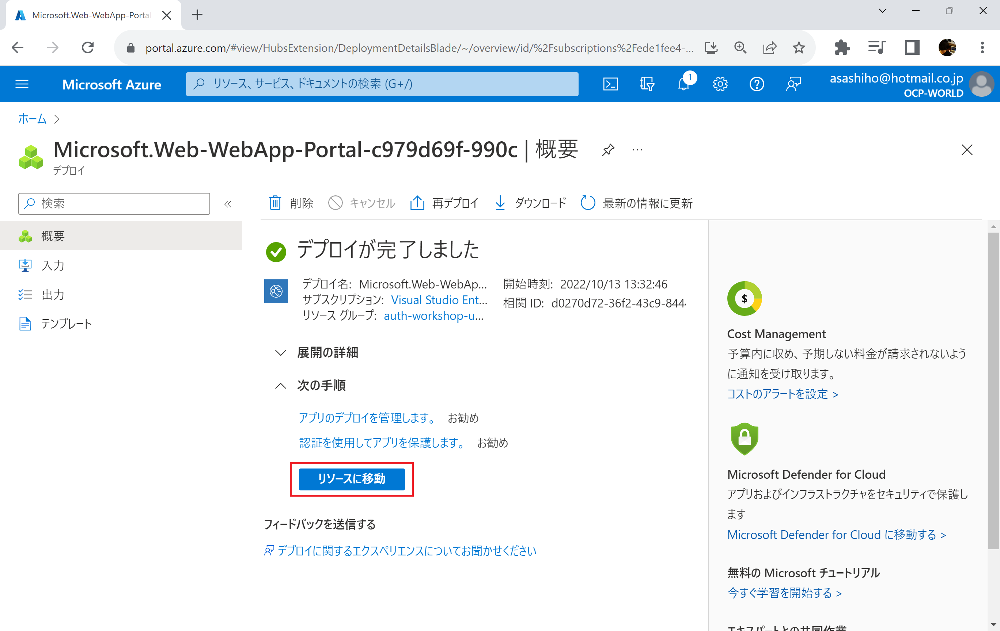

# **🔐Azureアプリケーション認証認可 ワークショップ**
「Webアプリケーションを開発したいけどログイン画面はどう実装するの？」「REST API を作ったけどアクセス制御はどうするべき？」アプリケーション開発の際、頭を悩ませる問題の1つに「認証認可」があります。これらを自前で安全に実装する場合、プログラミングだけでなく高度なセキュリティの知識が必要です。このワークショップではAzure AD とAzureのPaaS を活用したコーディングレスでできるソリューションを体験いただき、Azure AD はじめ、Microsoftが提供する認証認可技術に関する知識を学ぶことができます。


* Part 1: はじめての認証認可～カレンダーアプリを作ってみよう～
* Part 2: AppServiceを使ったWebアプリケーションの認証認可
* Part 3: シングルページアプリケーションとAPIの認証認可


## 事前準備

ワークショップを始める前に、お使いの開発マシンに次の環境を準備します。
* [Visual Studio Codeのインストール](https://code.visualstudio.com/download)
* [Dockerのインストール](https://www.docker.com/get-started)

また、Part 3 開発者向けのワークショップまで進みたい方はGitHubアカウントを用意してください。
* [GitHubアカウントの作成](https://github.co.jp/)


本ワークショップの受講者は、基本的なAzureの知識とAzure ポータルでの操作経験を前提としています。またPart 3についてはGitHubの操作経験とプログラミング知識が必要となります。


---
# **Part1: はじめての認証認可～カレンダーアプリを作ってみよう～** 

このパートでは、Azure ADを使ったアプリケーション認証認可の基礎を学ぶため、ローカルPCで動くアプリケーションとMicrosoft 365の情報をAPI経由で取得/更新できる **「Graph API」** を使って簡易カレンダーアプリを作ります。


#### このパートのゴール
* Azure ADをつかったアプリ認証の概要を理解する
* M365で管理するデータをGraph APIで取得できることを確認する


## 💻ハンズオン
### 0. サンプルアプリケーションのダウンロード
[こちら](https://github.com/asashiho/auth-workshop)のリンクからサンプルのアプリケーションをダウンロードし、ローカルPCの任意の場所に解凍します。

GitHubからクローンする場合は次のコマンドを実行します。

```bash
git clone https://github.com/asashiho/auth-workshop
```

解凍した「part1/graph-sample」には次のファイルが含まれます。


次にVisual Studio Codeを起動します。 **[表示]-[拡張機能]** を選び、検索で **「Dev Containers」** を選び、この拡張機能を **[インストール]** をします。これはコンテナ環境で開発環境を動かすための拡張機能です。


次に **[ファイル]-[フォルダを開く]** を選び **「auth-workshop/part1/graph-sample」** フォルダを開いてください。

!>もし異なるフォルダを開いている場合、本ワークショップで必要な環境がセットアップされませんので、注意してください。


サンプルフォルダを開いたら、Visual Studio Codeの左下の[`><`]アイコンをクリックして「`ReOpen in Container`」を選びます。


しばらくすると、[`>< Dev Container: Python3`]となり、次のようなターミナル(コマンドを実行する箇所)が表示されます。これは、開発に必要な環境一式がDockerコンテナとして起動できるVisual Studio CodeのDevContainersという機能を使っています。もしエラー等で起動できない場合は、ローカルPCでDockerコンテナが動作しているかを確認してください。


これで開発の準備ができました。


?>**コンテナを活用した開発環境の構築**<br>
アプリケーションを開発するときに、まず行うべきことは開発環境の作成です。言語ランタイムやライブラリをデバッグやテストに必要なツール群をインストール・設定する必要があります。
Visual Studio CodeのRemote-Containers 拡張機能を使用すると、開発環境をDockerコンテナで動かすことができます。
コンテナ内に開発環境を閉じ込めることができるため、ランタイムバージョンの異なる環境・開発言語が異なる環境もコンテナを切り替えるだけで利用できます。
また、標準化した環境を作成するためのDockerfileを作っておけば、大規模プロジェクトで複数の開発するメンバーが参画するときも、コンテナイメージを共有すればよいだけので、統一された環境をつかって開発を始めることができます。<br>
 公式ドキュメント:「[Developing inside a Container](https://code.visualstudio.com/docs/remote/containers)」

### 1. Azure ADへのアプリケーション登録
Azure ADはユーザの認証認可だけでなく、アプリへのシングルサインオンを行う機能があります。そのとき、WebアプリケーションからAzure ADで認証する場合、Azure ADからしてみれば、安全でないWebアプリケーションからの認証要求は受け付けたくありません。
そこで、Azure ADではどのアプリからであれば認証要求を受け付けるかを設定するため **「アプリの登録」** を行います。

WebブラウザでAzure ポータルを開き、Azure Active Directoryを選びます。


次に、右メニューから **「アプリの登録」** を選択します。ここで **「+新規登録」** をクリックします。


ここで、アプリケーションの名前で「`graph-sample-userXX`」(userはご自身の値に変更)を入力し、サポートされているアカウントの種類を「**任意の組織ディレクトリ内のアカウント**  (任意の Azure AD ディレクトリ - マルチテナント) と個人の Microsoft アカウント (Skype、Xbox など)」にして、 **「登録」** をクリックします。


これでアプリケーションの登録が完了しました。ここでアプリケーションを識別するための<span style="font-weight: bold; color: red;">「アプリケーション (クライアント) ID」</span>の値をメモしてください。この値は後で利用します。


次にリダイレクトURLを設定します。認証が完了したあとに戻るアプリケーションの場所を登録します。 **[リダイレクトURLを追加する]** をクリックし、 **[+プラットフォームを追加]** をクリックします。


アプリケーションの種類を聞かれますので、 **「シングルページアプリケーション」** を選びます。シングルページアプリケーションとは、クライアントのWebブラウザで動作するアプリケーションで、ここ最近多くのシステムで採用されています。


リダイレクトURLを設定します。ここでは 「 **http://localhost:8080** 」 を入力します。ユーザーが正常に認証またはサインアウトされた後に認証応答 (トークン) を返すときに宛先として受け入れられるURIです。なお「localost」とはローカルPCのアドレスを意味します。

**[構成]** をクリックして完了します。


次に登録したアプリのアクセス権を確認しましょう。 **[APIのアクセス権]** を開き、このアプリに許可されたアクセス権をチェックします。ここでは、**「Microsoft Graph」** に対して **「User.Read」権限** が割り当てられているのが分かります。


これでAzure ADにアプリの登録が終わりました。

?> 公式ドキュメント: [アプリケーションを Azure AD に追加する方法と理由](https://learn.microsoft.com/ja-jp/azure/active-directory/develop/active-directory-how-applications-are-added)

?> 公式ドキュメント: [チュートリアル: アプリを Azure Active Directory に登録する](https://learn.microsoft.com/ja-jp/power-apps/developer/data-platform/walkthrough-register-app-azure-active-directory)

?> 公式ドキュメント: [Microsoft Graph Toolkit で使用する Azure Active Directory アプリを作成します](https://learn.microsoft.com/ja-jp/graph/toolkit/get-started/add-aad-app-registration)


### 2.サンプルアプリの修正

Visual Studio Codeをでアプリのトップページとなる`index.html`を開きます。

ここでソースコードから次の箇所を見つけ、「`client-id`」の値に前の手順で登録したAzure ADのアプリ登録の<span style="font-weight: bold; color: red;">「アプリケーション (クライアント) ID」</span>を貼り付けます。


修正できたらファイルを保存します。


### 3.動作確認
Visual Studio Codeの画面下にあるターミナルで次のコマンドを入力し、Webサーバを実行します。

```bash
vscode ➜ /workspaces/graph-sample $ python3 server.py
```


Webブラウザで **「http://localhost:8080/」** を開きます。

すると、サインイン画面が表示されます。ここで、有効なユーザアカウントを入力し[次へ]をクリックします。環境によっては、多要素認証などが必要な場合もあります。


次に、**「要求されているアクセス許可」** の画面が表示されます。これは、アプリケーションがユーザに代わってアクセスするのを承諾するかどうかを確認するものです。

承諾するとアプリに次の権限が付与されます。

|                                 項目                                  |                                                                                                 内容                                                                                                  |
| --------------------------------------------------------------------- | ----------------------------------------------------------------------------------------------------------------------------------------------------------------------------------------------------- |
| プロフィールの読み取り                                                | graph-sample-user1 は、プロフィールの読み取りを行えます。                                                                                                                                             |
| graph-sample-user1 にアクセス権を与えたデータへのアクセスを管理します | 現在アプリを使用していない場合でも、アクセス許可を与えた graph-sample-user1 によって、データを表示し更新することを許可します。これにより、graph-sample-user1 には追加のアクセス許可は与えられません。 |


内容を確認し、**「はい」** をクリックします。


認証に成功すると、次のようにユーザのプロファイルが表示されます。


## 📓技術解説
このハンズオンを通して、Azure ADを使ってアプリケーションに認証機能をつけて、ユーザのプロファイル情報を取得する方法を学びました。

これを応用することで、M365のようなアプリケーションを作ることやオンプレミスその他で動くアプリケーションにAzure ADと連携した認証機能をつけることができることが分かりました。

このハンズオンの内容をより理解するため、次のスライドで学習しましょう。

<a href="images/azure-auth-workshop-docs.pdf" target="_blank">Azureアプリケーション認証認可ワークショップ.pdf</a>

## 📖演習

サンプルコードを修正して、次のようにカレンダー情報を取得してみましょう。


?> 公式ドキュメント: [Microsoft Graph ツールキットを使ってアプリを開発](https://learn.microsoft.com/ja-jp/training/paths/m365-msgraph-toolkit/)


---
# **Part2: AppServiceを使ったWebアプリケーションの認証認可** 

このパートでは、Azure AppServiceを使ってフロントエンドアプリとバックエンドアプリを動かし、フロントエンドアプリでAppServiceの組み込み認証機能を使って、コーディングレスでアプリケーションに認証機能を追加します。


?>このパートはすでに用意されているDockerイメージを使って動作確認を行うので、プログラミング経験が無い方でも実施できます。

#### このパートのゴール
* AppServiceの組み込みの認証の概要を理解する
* フロントエンドとバックエンドで構成されるアプリケーションにコーディングレスでユーザ認証を追加できる


## 💻ハンズオン

### 0. サンプルアプリケーションのダウンロード
[こちら](https://github.com/asashiho/auth-workshop)のリンクからサンプルのアプリケーションをダウンロードし、ローカルPCの任意の場所に解凍します。

GitHubからクローンする場合は次のコマンドを実行します。

```bash
git clone https://github.com/asashiho/auth-workshop
```

次に **[ファイル]-[フォルダを開く]** を選び **「auth-workshop/part2」** フォルダを開いてください。

!>もし異なるフォルダを開いている場合、本ワークショップで必要な環境がセットアップされませんので、注意してください。

このフォルダをVisual Studio Codeで開き、Visual Studio Codeの左下の[`><`]アイコンをクリックして「`ReOpen in Container`」を選びます。

しばらくすると、[`>< Dev Container: Node.js`]となります。もしエラー等で起動できない場合は、ローカルPCでDockerコンテナが動作しているかを確認してください。


これで開発の準備ができました。

?> 公式ドキュメント:[Developing inside a Container](https://code.visualstudio.com/docs/remote/containers)


### 1. バックエンドアプリ(API)のデプロイ

まず初めにバックエンドアプリとなるAPIをデプロイします。


Azure ポータルを開きリソース作成メニューの **「コンテナ」** の中にある **「Web App for Containers」** を新規作成します。


Webアプリの作成画面で有効なサブスクリプションを選びリソースグループを新規作成します。ここでリソースグループ名は **「auth-workshop-userXX」** <span style="font-weight: bold; color: red;"> ※ 以降 userXXはご自身のユーザ名に合わせて変更</span>としてください。


次にインスタンスの名前を **「auth-workshop-userXX-backend」** とし、 **「Dockerコンテナ」「Linux」** を選びます。

!>インスタンスの名前はPart 3のワークショップでそのまま使用します。ここでは任意の名前にせず、必ずご自身に割り当てられたユーザ名を含む名前にしてください。たとえば「user1」の場合は「auth-workshop-user1-backend」となります。自分のユーザ名が分からない方は講師に確認してください。

デプロイするリーションは **「Japan East」** (東日本リージョン)を選びます。


続いてApp Serviceプランを作成します。新しいApp Serviceプランの名前を **「auth-workshop-userXX」** として **[OK]** をクリックします。このApp ServiceプランはWebAppsを動かすためのサーバのスペックを定義するものです。ゾーン冗長は **「無効」** のままで **[次: デプロイ]** ボタンをクリックします。


次にデプロイの手順を選びます。GitHub Actionsを利用するとソースコードの更新をトリガーにアプリケーションのデプロイを自動化できますが、ここでは **「無効化」** を選びます。


次にデプロイするアプリケーションのDockerイメージを指定します。
Dockerのイメージソースを **「Docker Hub」**、アクセスの種類を **「パブリック」**、イメージとタグを「`asashiho/backend:1.0.0`」に設定して、
**[確認および作成]** ボタンをクリックします。


内容を確認して、 **[作成]** ボタンをクリックします。


デプロイが完了したら、 **[リソースに移動]** ボタンをクリックします。



!>もし「Japan East」 (東日本リージョン)でのデプロイやPremium SKUでのデプロイに失敗する場合は、他のリージョン/SKUで試してください。


作成したWebAppsの概要画面が表示されるので、 **[URL]** をコピーします。このURLがAPIのエンドポイントになります。


次に、Visual Studio Codeを開き、 **「REST.http」** というファイルを開きます。ここで、次の行を見つけ、`@backend_url`にWebAppsの画面でコピーしたURLを設定します。

```bash
Backend API using Java
@backend_url = https://auth-workshop-userXX-backend.azurewebsites.net <=ここを変更
```


次に、WebAppsにデプロイしたバックエンドAPIにリクエストを送信します。ここでは **「[Rest Client](https://github.com/Huachao/vscode-restclient)」** というVisual Studic Code上でHTTPリクエストを送信し、レスポンスを確認できるVisual Studio Codeの拡張機能を使っています。

たとえば、APIに対してPOSTリクエストを送信するときは **「Send Request」** リンクをクリックします

```bash
###
Send Request      <= ここをクリック
POST {{backend_url}}/api/v1/todos
```

データが登録できていれば、HTTP 201レスポンスが返ります。


登録されたデータを確認するには、GETリクエストを送信します。


余力のある方は、PUT/DELETEリクエストを送信してデータの登録/取得/変更/削除を行ってください。


もしバックエンドAPIの起動に時間がかかる場合は、 **[構成]** メニューの **[アプリケーション設定]** で **[+新しいアプリケーション設定]** を追加します。 

ここで次の値を設定しを再起動するまでに待機する時間を構成できます。 

```bash
WEBSITES_CONTAINER_START_TIME_LIMIT=1800
```


アプリケーション設定を変更した場合は、保存と再起動が必要になります。**[続行]** をクリックしてください。


!>バックエンドAPIのデプロイに5分程度時間がかかる場合があります。


なお、今回のバックエンドAPIの仕様は次のURLで確認できます。
```
https://auth-workshop-userXX-backend.azurewebsites.net/swagger-ui/index.html
```


どのようなデータが取得できるか確認してください。

APIは処理結果がJSONで返却されることが一般的です。人間にとっては解釈しづらいもののアプリケーションからの取り扱いは容易になるため、APIを介して取得したデータをもとにWebアプリをつくったり、モバイル端末で動くAndroidアプリケーションや車載器に組み込んだIoT機器などからのアクセスもできるようになります。

?> 公式ドキュメント: [REST Client](https://marketplace.visualstudio.com/items?itemName=humao.rest-client)


### 2. フロントエンドアプリ(UI)のデプロイ
バックエンドAPIの準備ができ必要なデータがJSON形式で取得できるようになったので、次はブラウザかからアクセスできるUIとなるフロントエンドアプリをWebAppsにデプロイします。


手順はバックエンドアプリと同じです。Azure ポータルを開きリソースの作成メニューの **「コンテナ」** から **「Web App for Containers」** を新規作成します。

Webアプリの作成画面で有効なサブスクリプションを選び、リソースグループ **「auth-workshop-userxx」** を選びます。

次にインスタンスの名前を **「auth-workshop-userXX-frontend」** とし、**「Dockerコンテナ」「Linux」** を選びます。


デプロイするリーションは **「Japan East」** (東日本リージョン)を選びます。
続いてApp Serviceプランを **「auth-workshop-userXX」** として **[OK]** をクリックします。


次にデプロイの手順を選びます。GitHub Actionsを利用するとソースコードの更新をトリガーにアプリケーションのデプロイを自動化できますが、ここでは **「無効化」** を選びます。

次にデプロイするアプリケーションのDockerイメージを指定します。
Dockerのイメージソースを **「Docker Hub」** 、アクセスの種類を **「パブリック」** 、イメージとタグを **「`asashiho/frontend:userXX`」** に設定して、 **[確認および作成]** ボタンをクリックします。バックエンドアプリとはイメージの名前が異なりますので注意してください。

!>コンテナイメージのタグは必ずご自身に割り当てられたユーザ名を含む名前にしてください。たとえば「user1」の場合は「asashiho/frontend:user1」となります。自分のユーザ名が分からない方は講師に確認してください。


内容を確認して、 **[作成]**  ボタンをクリックしデプロイが完了したら、 **[リソースに移動]** ボタンをクリックします。

AppService の概要画面を開き、 **[URL]** をコピーします。このURLがフロントエンドアプリのエンドポイントになります。


ブラウザでフロントエンドアプリのURLにアクセスすると、バックエンドAPIから取得したデータが表示されているのがわかります。新規データの登録や削除を試してください。


これでサンプルアプリの準備が完了しました。


### 3. 組み込み認証機能の有効化
サンプルのWebアプリケーションが動作しましたが、今はインターネットから誰でもアクセスが可能な状態になっています。

そこで、アプリに認証機能を追加します。Part 1の手順のとおり手動でAzure ADにアプリ登録を行うこともできますが、AppServiceには便利な **「組み込みの認証」** が用意されています。これを使うことでコーディングレスでサインイン/サインアウト処理を追加できます。

App Serviceの組み込み認証は、次のプロバイダをサポートしています。

* Azure AD
* Microsoft アカウント
* Facebook
* Google
* Twitter

組み込み認証を有効にすると、AppService内で認証と認可のミドルウェアコンポーネントが動作します。このミドルウエアは、アプリケーションと同じVMで実行されます。この組み込み認証機能が有効になっている場合、すべてのHTTPリクエストは、アプリケーションによって処理される前に処理をおこないます。また取得したトークン情報はAppServiceが管理する「トークンストア」に安全に保持されます。


このミドルウエアコンポーネントは、デプロイしたアプリケーションに対して処理を行います。
* 指定されたID プロバイダーを使用してユーザとクライアントを認証
* 構成済みのID プロバイダーによって発行されたOAuth トークンを検証/格納/更新
* 認証されたセッションの管理
* HTTPリクエストヘッダーに ID 情報を挿入


このモジュールは、アプリケーション コードとは別に実行され、Azure Resource Managerの設定または構成ファイルを使用して設定します。 SDK/特定のプログラミング言語に依存せずアプリケーションコードを変更することなく利用できます。

<hr />
それでは、実際にデプロイしたフロントエンドアプリに対して組み込み認証を有効化して機能を試してみましょう。


Azure ポータルを開き **「auth-workshop-userXX」** リソースグループにある **「auth-workshop-userXX-frontend」** を開きます。

メニューの **[認証]** を選び **[IDプロバイダを追加]** をクリックします。


IDプロバイダを選択するドロップダウンから **「Microsoft」** を選びます。これを選ぶとAzure ADによるサインインが有効になります。


次にアプリの登録を行います。名前は **「auth-workshop-userXX-frontend」** とし、サポートされているアカウントの種類として **「現在のテナントー単一テナント」** を選びます。これにより、フロントエンドアプリをデプロイしているテナントに対して有効になります。


次にAppService認証設定を選択します。 **「認証が必要」** を選ぶとアクセスするリクエストに対してユーザ認証を強制します。また認証されていない場合の処理として **「HTTP 302リダイレクトが見つかりました」** を選びます。最後にトークンストアにチェックボックスを入れて **[アクセス許可]** に進みます。


次に、Microsoft Graphへのアクセス許可を行います。設定ができたら **[追加]** をクリックします。 


IDプロバイダが設定できると次の画面になります。ここでどのような設定が自動で行われているのかを確認しましょう。IDプロバイダのリンク **「auth-workshop-userXX-frontend」** をクリックします。


ここで、Part 1では手動で設定したAzure ADへのアプリ登録がAppServiceによって自動設定されているのが分かります。


**[リダイレクトURL]** のリンクをクリックしてみましょう。すると、プラットフォームが自動で追加され、リダイレクトURLにAppServiceにデプロイしたフロントエンドのコールバック先が登録されているのが分かります。


これで設定が完了したので、動作確認を行います。ブラウザから再びフロントエンドのURLにアクセスします。すると、先ほどは聞かれなかった認証画面に遷移します。ここで有効なアカウントでログインしてみましょう。


次に、 **「要求されているアクセス許可」** の画面が表示されます。これは、アプリケーションがユーザに代わってアクセスするのを承諾するかどうかを確認するものです。内容を確認して **[Accept]** をクリックします。


認証に成功するとアプリの画面が表示されます。


?> 公式ドキュメント: [チュートリアル: Azure App Service で実行されている Web アプリにアプリの認証を追加する](https://learn.microsoft.com/ja-jp/azure/app-service/scenario-secure-app-authentication-app-service)」

?> 公式ドキュメント: [Azure App Service および Azure Functions での認証と承認](https://learn.microsoft.com/ja-jp/azure/app-service/overview-authentication-authorization)


### 4. 認証トークンの確認

**[Profile]** をクリックすると、JSONデータが表示されます。この内容を確認してみましょう。データをコピーしてVisual Studio Codeの`token.json` に貼り付けます。


このままでは分かりにくいので、 **[Shift]+[Alt]+[F]** キーを押下してドキュメントを整形します。


JSONファイルにどのようなデータがあるかを確認しましょう。

次に`access_token` の値を選択した状態で **[表示]-[コマンドパレット]-[JWT Debugger Decode]** を選択します。


すると、JWTを解析したヘッダ/ペイロード/署名が表示されます。内容を確認してみましょう。


?> JWTトークンの確認ができる[jwt.io](https://jwt.io/)を使って確認してもかまいません

それでは、この組み込み認証を使って実際にアプリケーションでどのように実装すればよいかを説明します。


#### ログイン/ログアウト処理
ログイン処理とログアウト処理を行いたいときは`/.auth/login`および`/.auth/logout`に対してリンクを設定します。

```html
<a href="/.auth/login" role="button">Login</a>
<a href="/.auth/logout"role="button">Logout</a>
```

ここでサンプルアプリの **[Login]** と **[Logout]** ボタンをクリックして動作を確認してみましょう。

?> 公式ドキュメント: [Azure App Service 認証でのサインインとサインアウトのカスタマイズ](https://learn.microsoft.com/ja-jp/azure/app-service/configure-authentication-customize-sign-in-out)


#### ユーザ情報/トークンを取得する
アプリでトークンストアが有効になっている場合は、`/.auth/me` を呼び出して認証されたユーザ情報の詳細が取得できます。この中にはアクセストークンやIDトークンも含まれていることが分かります。

```html
<a href="/.auth/me" role="button">Profile</a>
```

サーバーサイドのプログラムの場合、ミドルウエアがリクエストヘッダに次の値を自動的に挿入します。プログラムのコード内でこれらの値を取得して利用できます。

|      プロバイダー      |               ヘッダー名               |
| ---------------------- | -------------------------------------- |
| Azure Active Directory | X-MS-TOKEN-AAD-ID-TOKEN                |
|                        | X-MS-TOKEN-AAD-ACCESS-TOKEN            |
|                        | X-MS-TOKEN-AAD-EXPIRES-ON              |
|                        | X-MS-TOKEN-AAD-REFRESH-TOKEN           |
| Facebook トークン      | X-MS-TOKEN-FACEBOOK-ACCESS-TOKEN       |
|                        | X-MS-TOKEN-FACEBOOK-EXPIRES-ON         |
| Google                 | X-MS-TOKEN-GOOGLE-ID-TOKEN             |
|                        | X-MS-TOKEN-GOOGLE-ACCESS-TOKEN         |
|                        | X-MS-TOKEN-GOOGLE-EXPIRES-ON           |
|                        | X-MS-TOKEN-GOOGLE-REFRESH-TOKEN        |
| Twitter                | X-MS-TOKEN-TWITTER-ACCESS-TOKEN        |
|                        | X-MS-TOKEN-TWITTER-ACCESS-TOKEN-SECRET |


例えばJavaの場合、コントローラに次のようなコードを書くことでこれらのデータに簡単にアクセスできます。

```java
@RestController
public class HogeController {
  ...
	@GetMapping("/api/hoge")
	public Hoge hoge(
		@RequestHeader(value="User-Agent") String userAgent, 
		@RequestHeader(value="X-MS-TOKEN-AAD-ID-TOKEN") String idToken,
		@RequestHeader(value="X-MS-TOKEN-AAD-ACCESS-TOKEN") String accessToken,
		@RequestHeader(value="X-MS-TOKEN-AAD-EXPIRES-ON") String expiresOn,
		@RequestHeader(value="X-MS-TOKEN-AAD-REFRESH-TOKEN") String refreshToken
		) {
   ....
    }
```

?> 公式ドキュメント: [Azure App Service 認証でユーザー ID を操作する](https://learn.microsoft.com/ja-jp/azure/app-service/configure-authentication-user-identities)


#### トークンの更新
アクセストークンが期限切れになった場合は、そのトークンを再度使用する前に、ユーザーを再認証する必要があります。 アプリケーションの`/.auth/refresh` エンドポイントに GETリクエストを送信して、トークンの期限切れを回避できます。子のエンドポイントが呼び出されると、App Serviceは認証されたユーザのトークンストア内のアクセストークンを自動的に更新します。

?> 公式ドキュメント: [認証トークンを更新する](https://learn.microsoft.com/ja-jp/azure/app-service/configure-authentication-oauth-tokens#refresh-auth-tokens)


## 📓技術解説
このハンズオンを通して、AppServiceの組み込み認証を使ってコーディングレスで認証を行う方法と取得したトークンの取得や利用方法を学びました。

このハンズオンの内容をより理解するため、次のスライドで学習しましょう。

<a href="images/azure-auth-workshop-docs.pdf" target="_blank">Azureアプリケーション認証認可ワークショップ.pdf</a>


## 📖演習

Part 2のハンズオンの状態では、テナントの全員が認証に成功すればアプリケーションにアクセスできてしまいます。Aさんにはアクセスを許可するけど、Bさんは禁止するということを行う場合どのようにすればよいか、参加者同士でディスカッションしてみましょう。


アプリケーション開発の観点、セキュリティ観点や運用保守観点などを考慮して、自社にとってベストな方式はなにかを整理してみましょう。


---
# **Part3: シングルページアプリケーションとAPIの認証認可** 

ここまでのワークショップでAzure ADを使ったアプリケーションの認証認可の概要とAppServiceの組み込み認証機能を使うと、簡単に認証認可の処理をアプリケーションに取り込むことができ、ユーザおよびアプリケーションの管理をAzure ADで管理できることが分かりました。

今回のサンプルはフロントエンドはReactによるシングルページアプリケーション、バックエンドAPIはSpring Boot/JPAを使ったREST APIになっています。

このパートでは、より実践的なAzureアーキテクチャとしてStatic Web AppsとAppServiceを組み合わせた構成での認証認可を実装していきます。

?>Part 3はプログラミング経験がある方を前提としています。もし時間内に終わらなかった場合は持ち帰って各自復習してください。


#### このパートのゴール
* フロントエンドとバックエンドで構成されるアプリケーションの認証認可の全体像を理解する
* Static Web AppsとAppServiceを使ったWebアプリの認証認可を実装する


## 💻ハンズオン

### 0. サンプルアプリケーションのダウンロード

次のコマンドを実行し、GitHubからサンプルコードをクローンします。なお、SSHでクローンする場合はSSHキーの設定が必要になります。

```bash
git clone https://github.com/asashiho/auth-workshop
```

次に **[ファイル]-[フォルダを開く]** を選び **「auth-workshop/part3/frontend」** フォルダを開いてください。

!>もし異なるフォルダを開いている場合、本ワークショップで必要な環境がセットアップされませんので、注意してください。


Visual Studio Codeの左下の[`><`]アイコンをクリックして「`ReOpen in Container`」を選びます。

しばらくすると、[`>< Dev Container: Node.js`]となり、次のようなターミナル(コマンドを実行する箇所)が表示されます。もしエラー等で起動できない場合は、ローカルPCでDockerコンテナが動作しているかを確認してください。


これで開発の準備ができました。

?> 公式ドキュメント: [Developing inside a Container](https://code.visualstudio.com/docs/remote/containers)


### 1. バックエンドアプリ(API)のデプロイ
バックエンドアプリはPart2で利用したものをそのまま使います。Azure ポータルを開き **[auth-workshop-userXX]** リソースグループの **[auth-workshop-userXX-backend]** を開き、URLを確認します。


### 2. フロントエンドアプリ(UI)のデプロイ
Part 2ではフロントエンドアプリをバックエンドアプリと同じようにAppServiceで動かしました。しかしながらフロントエンドアプリはシングルページアプリケーションのため、「 **[Static Web Apps](https://learn.microsoft.com/ja-jp/azure/static-web-apps/)** 」を使ってホストすることもできます。

Static Web Appsは静的Webアプリのホストに特化したサービスで、Angular/React/Svelte/Vue/Blazorなど、サーバレンダリングが不要なライブラリとWebフレームワークを使用したアプリに適しています。AppServiceに比べて安価に運用できるのも特徴です。

また、Static Web Appsは静的アセットは世界各地の地理的に分散したポイントから提供されます。これによりエンドユーザは高速にファイルのダウンロードができます。またサーバサイドで動くバックエンドAPIと連携する機能も持っています。

Static Web Appsの主な機能は次のとおりです。

* HTML、CSS、JavaScript、画像などの静的コンテンツの Web ホスティング
* バックエンドAPIとの統合サポート
* GitHub/Azure DevOpsと連携したCI/CD
* コンテンツをユーザーの近くに配置する、グローバルに分散
* 自動更新される無料のSSL証明書
* カスタム ドメイン
* API の呼び出し時にリバースプロキシを使用するシームレスなセキュリティモデル
* <span style="font-weight: Bold; color: red;">Azure Active Directory/GitHub/Twitterの認証プロバイダー統合</span>
* カスタマイズ可能な認可ロールの定義と割り当て。
* コンテンツとルートを制御するバックエンド ルーティング規則
* ステージング機能
* ローカル開発用の Azure Static Web Apps CLI


<hr />
それでは、実際にデプロイして試してみましょう。

Visual Studio Codeでサンプルリポジトリを開き、 **[src]-[api]-[Backend.js]** ファイルを開きます。ここでは`baseURL`にフロントエンドアプリからアクセスするバックエンドAPIのURLを設定します。URLは<span style="font-weight: bold; color: red;">ご自身のユーザ名に合わせて変更</span>してください。

```javascript
baseURL: "https://auth-workshop-backend-userXX.azurewebsites.net/api/v1",
```


[GitHub](https://github.com/new)にアクセスして、新しいリポジトリを作成します。リポジトリ名は **「auth-workshop-userXX-frontend」** とします。


次に、Visual Studio Codeのサンプルリポジトリを開き、ターミナルで次のコマンドを実行します。ここでリモートリポジトリの名前は<span style="font-weight: bold; color: red;">ご自身のユーザ名に合わせて変更</span>してください。

```bash
git config --global user.email "you@example.com"
git config --global user.name "Your Name"

git init
git add *
git commit -m "first commit"
git branch -M main
git remote add origin git@github.com:<your GitHub Name>/auth-workshop-userXX-frontend.git
git push -u origin main
```

GitHubにソースコードがプッシュ出来ているかを確認します。


Azure ポータルを開き、 **[リソースの作成]** から **[Web]-[静的Webアプリ(Static Web Apps)]** を選びます。


リソースグループ **[auth-workshop-userXX]** を選び、名前を **「auth-workshop-userXX-frontend」** 、プランの種類を **「Standard」**、リージョンを **「East Asia」** にします。

デプロイの詳細で **「GitHub」** を選択し **[GitHubアカウントでサインイン]** ボタンをクリックしてGitHubにサインインします。


次にGitHubのリポジトリを選択します。ここでは先ほど作成した **「auth-workshop-userXX-frontend」** のメインブランチを選び、 **[React]** を選択します。

内容に問題が無ければ **[確認および作成]** をクリックします。


GitHubと連携することで自動でGitHub Actionsのワークフローファイルが作成されます。GitHubのリポジトリを開き **[Actions]** を確認します。すると、BuildとDeployのPipelineが実行されているのが分かります。


デプロイが完了したら **[リソースに移動]** をクリックします。ここで、エンドポイントのURLを確認できます。


ブラウザでエンドポイントのURLにアクセスしてみましょう。ユーザ認証画面が表示されるので有効なアカウントでログインしてください。


次にアプリケーションの同意画面が表示されます。内容を確認して **[Grant Consent]** をクリックします。


認証されるとフロントエンドアプリにアクセスできます。またバックエンドAPIから取得したTodoデータも表示されていることが分かります。


### 3. Static Web Appsの組み込み認証機能
Static Web Appsはデフォルトで次のプロバイダでの認証が有効になっています

* Azure Active Directory
* GitHub
* Twitte

詳細な設定はサンプルリポジトリのルートにある「`staticwebapps.config.json`」で行います。


#### 認証の強制
アクセスしたユーザに認証を強制させたい場合は、「`staticwebapps.config.json`」に以下を追加します。

```json
  "routes": [
    {
      "route": "/",
      "allowedRoles": ["authenticated"]
    },
```
また、ログインしていない場合はログイン画面に遷移させるときは次を設定します。

```json
  "responseOverrides": {
    "401": {
      "redirect": "/login",
      "statusCode": 302
    }
  }
```

#### ログインログアウト処理

ログイン処理とログアウト処理を行いたいときは`/.auth/login/<provider name>`および`/.auth/logout/<provider name>`に対してリンクを設定します。

|       プロバイダ       |    ログインルート    |
| ---------------------- | -------------------- |
| Azure Active Directory | /.auth/login/aad     |
| GitHub                 | /.auth/login/github  |
| Twitter                | /.auth/login/twitter |

たとえば、Azure ADの場合は次のようになります。
```html
<a href="/.auth/login/aad" role="button">Login</a>
<a href="/.auth/logout/aad"role="button">Logout</a>
```

サンプルアプリの **[Login]** と ** [Logout]** ボタンをクリックして動作を確認してみましょう。

?> 公式ドキュメント: [Azure Static Web Apps の認証と承認](https://learn.microsoft.com/ja-jp/azure/static-web-apps/authentication-authorization?tabs=invitations)


#### ユーザ情報の取得
Static Web Appsでは`/.auth/me` を呼び出して認証されたユーザ情報が取得できます。ただし、Part 2で利用したAppServiceのようにトークンを取得することはできません。

```html
<a href="/.auth/me" role="button">Profile</a>
```

`/.auth/me` にアクセスすると次のような情報が取得できます。
```json
{
  "clientPrincipal": {
    "identityProvider": "aad",
    "userId": "xxxxxx",
    "userDetails": "user@domain.co.jp",
    "userRoles": [
      "anonymous",
      "authenticated"
    ]
  }
}
```

次のコードでユーザ情報を取得できます。

```javascript
async function getUserInfo() {
  const response = await fetch('/.auth/me');
  const payload = await response.json();
  const { clientPrincipal } = payload;
  return clientPrincipal;
}

console.log(await getUserInfo());
```

サンプルアプリの **[Profile]** ボタンをクリックして動作を確認してみましょう。

?> 公式ドキュメント: [Azure Static Web Apps でのユーザー情報へのアクセス](https://learn.microsoft.com/ja-jp/azure/static-web-apps/user-information?tabs=javascript)


#### ロールの管理
Static Web Appsのアプリにアクセスするすべてのユーザーは、1つまたは複数のロールに属しています。 ユーザは、以下の2つの組み込みロールに属することができます。


|     ロール     |                              説明                               |
| -------------- | --------------------------------------------------------------- |
| 匿名ロール     | すべてのユーザーは自動的に 「匿名」 ロールに属する              |
| 認証済みロール | ログインしているすべてのユーザーは、「認証済み」 ロールに属する |


組み込みロール以外にカスタム ロールをユーザーに割り当てることもできます。手順については、[ロール管理](https://learn.microsoft.com/ja-jp/azure/static-web-apps/authentication-authorization?tabs=invitations#role-management)を確認してください。


#### カスタム認証
Azure Static Web Apps が提供する組み込み認証では、Azureが管理するプロバイダー登録が使用されます。登録の柔軟性を高めるため、既定値をカスタム登録でオーバーライドできます。

またカスタム認証により、OpenID Connect をサポートするカスタム プロバイダーを構成できます。この構成では、複数の外部プロバイダーを登録できます。

ただし、カスタム登録を使用すると、事前構成済みのすべてのプロバイダーが無効になります。

カスタム認証を行うときは、「`staticwebapps.config.json`」に次の設定を行います。

```json
  "auth": {
    "identityProviders": {
        "azureActiveDirectory": {
            "registration": {
                "openIdIssuer": "https://login.microsoftonline.com/<AAD_TenantID>",
                "clientIdSettingName": "<AAD_ClientID>",
                "clientSecretSettingName": "<AAD_Client_Secret>"
            }
        }
    }
  },
```

?> 公式ドキュメント: [Azure Static Web Apps でのカスタム認証](https://learn.microsoft.com/ja-jp/azure/static-web-apps/authentication-custom?tabs=aad)

今回のワークショップで使用したAppServiceとStatic Web Appsはどちらも組み込みの認証機能が用意されていますが、できることや実装方法が異なりますので注意してください。なお、最新の情報については、各サービスの公式ドキュメントを参照してください。


### 4. バックエンドAPIの保護
ここまでの手順でStatic Web Appsを使ったフロントエンドアプリの認証認可はできるようになりましたが、バックエンドAPIはURLさえわかればどこからでも呼び出し可能な状態になっています。

ためしに別のメンバーが作成したバックエンドURLにアクセスしてみましょう。自由にデータを読み書きできるのが分かります。

Static Web AppsにはAPIと連携する機能があります。

* ユーザ認証とロールベースの承認データに直接アクセスできる統合セキュリティ
* カスタムCORSルールを必要とせずフロントエンドアプリで`/api` ルートを使用したルーティング

これを使ってバックエンドAPIを保護しましょう。現在対応しているバックエンドAPIのホスティングサービスは以下のとおりです。

* Azure Functions
* Azure API Management
* Azure App Service
* Azure Container Apps

?> 簡易なシステムで手軽に利用できるStatic Web Appsが管理するマネージドAPI(Azure Functionベース)も用意されています。


今回のサンプルアプリはバックエンドAPIをAppServiceで動かしていますので、Static Web Appsのフロントエンドと連携させてみましょう。

Auzre Portalを開き、リソースグループ **「auth-workshop-userXX」** を選び、名前が **「auth-workshop-userXX-frontend」** のStatic Web Appsをクリックします。

メニューの **[API]** を選択します。ここで **[Production]** 環境にデプロイされているフロントエンドアプリにバックエンドを連携させるため **[リンク]** をクリックします。


バックエンドを選択する画面が表示されるので、バックエンドリソースの種類を **「Webアプリ」** とし、リソース名に **「auth-workshop-userXX-backend」** を選びます。問題なければ **[リンク]** をクリックします。


すると、自動的にAppService上のバックエンドAPIに対して認証が設定されます。バックエンドリソース名で **「auth-workshop-userXX-backend」** リンクをクリックします。

すると、バックエンドAPIがホストされているAppServiceに移動しますので、ここで **[認証]** メニューを確認します。すると、これまでは設定されていなかった認証プロバイダがStatic Web Appsに自動で設定されているのが分かります。


続いてソースコードを改修します。Visual Studio Codeでサンプルリポジトリを開き、 **[src]-[api]-[Backend.js]** ファイルを開きます。ここでは`baseURL`にフロントエンドアプリからアクセスするバックエンドAPIのURLを設定します。

* 変更前
```javascript
baseURL: "https://auth-workshop-user1-backend.azurewebsites.net/api/v1",
```

* 変更後
```javascript
baseURL: "/api/v1",
```
Static Web AppsとAPI連携することで、`/api/v1`へのリクエストをAppService上のバックエンドAPIにルーティングします。


コードの修正が終わったら次のコマンドを実行して、ソースコードをGitHubにPushします。

```bash
git pull
git add src/api/Backend.js
git commit -m "Update: Backend URL"
git push
```

これでGitHub Actionsが再び実行され、最新のソースコードをビルドしたアプリがStatic Web Appsにデプロイされます。

動作確認でStatic Web Apps上のフロントエンドにアクセスしてみましょう。バックエンドと連携しデータの読み書きができるのが分かります。


一方、Part 2でデプロイしたAppServiceのエンドポイントにアクセスしてみるとどうなるでしょうか？バックエンドAPIはStatic Web Appsのフロントエンドからしかアクセスを受け付けないため、データ取得ができなくなっているのが分かります。


再び別のメンバーが作成したバックエンドURLにもアクセスしてみましょう。同様にデータにアクセスできなくなっているのが分かります。


### 補足: Microsoft ID プラットフォームとは
ワークショップで実施した、アプリケーション開発時に必要な情報やライブラリ・サンプルコードは[Microsoft ID プラットフォームのドキュメント](https://learn.microsoft.com/ja-jp/azure/active-directory/develop/)にまとまっています。

本日のワークショップでは、AzureのPaaS製品の組み込みの認証機能を使ったコーディングレスでの実装をフォーカスしてご紹介しましたが、より柔軟に自社アプリケーションに組み込みたいときは、Microsoftが提供する **「Microsoft Authentication Library(MSAL)」** の利用を検討してください。


Microsoft Authentication Library(MSAL)を使用すると、ユーザを認証し、セキュリティで保護されたAPI にアクセスする目的で、Microsoft ID プラットフォームからトークンを取得できます。 これは、Microsoft Graph/その他の Microsoft API/サード パーティのAPI/自社開発したAPIに対して、セキュリティで保護されたアクセスができます。 

MSALはさまざまなアプリケーションアーキテクチャとプラットフォームをサポートしています。


|         ライブラリ         |                               サポートされているプラットフォームとフレームワーク                                |
| -------------------------- | --------------------------------------------------------------------------------------------------------------- |
| MSAL for Android           | Android                                                                                                         |
| MSAL Angular               | Angular と Angular.js のフレームワークを使用したシングルページ アプリ                                           |
| iOS および macOS 用の MSAL | iOS と macOS                                                                                                    |
| MSAL Go (プレビュー)       | Windows、macOS、Linux                                                                                           |
| MSAL Java                  | Windows、macOS、Linux                                                                                           |
| MSAL.js                    | Vue.js、Ember.js、Durandal.js など、JavaScript と TypeScript のフレームワーク                                   |
| MSAL .NET                  | .NET Framework、.NET Core、Xamarin Android、Xamarin iOS、ユニバーサル Windows プラットフォーム                  |
| MSAL Node                  | Express を使用した Web アプリ、Electron を使用したデスクトップ アプリ、クロスプラットフォーム コンソール アプリ |
| MSAL Python                | Windows、macOS、Linux                                                                                           |
| MSAL React                 | React と React ベースのライブラリ (Next.js、Gatsby.js) を使用したシングルページ アプリ                          |

?> 公式ドキュメント: [Microsoft Authentication Library (MSAL) の概要](https://learn.microsoft.com/ja-jp/azure/active-directory/develop/msal-overview)


## 📓技術解説
このハンズオンを通して、Static Web Appsを使ったシングルページアプリケーションの認証認可とAPIを保護する方法を学びました。

このハンズオンの内容をより理解するため、次のスライドで学習しましょう。


<a href="images/azure-auth-workshop-docs.pdf" target="_blank">Azureアプリケーション認証認可ワークショップ.pdf</a>


# 🗑Azureリソースの削除
本ワークショップで使用したAzureリソースは **「auth-workshop-userXX」** にあります。演習が終わった方は忘れずにリソースグループを削除してください。また、Azure ADで使用した「アプリの登録」も削除してください。


# まとめ
本来であれば開発者がセキュリティを考慮してアーキテクチャ設計/認証認可モジュールの実装を行う必要がある部分を、本ワークショップで利用したStatic Web Apps/AppServiceの組み込みの認証機能をうまく使うことで、業務ロジックの実装に専念できるようになります。

認証認可はWebシステムのセキュリティ対策の重要な技術要素です。他にもネットワークによる防御、コンテナセキュリティ、CI/CDワークロードの保護、依存関係ライブラリの脆弱性チェック、など開発者が考慮すべきことは多岐にわたります。Azureが提供するPaaSサービスをうまく活用することでクラウドネイティブなシステム開発してください。


おつかれさまでした☕